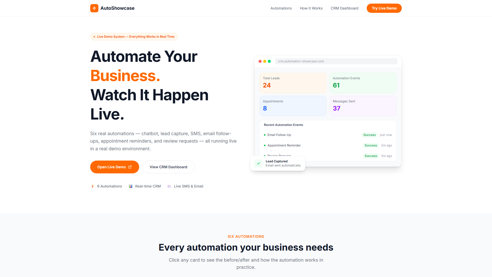
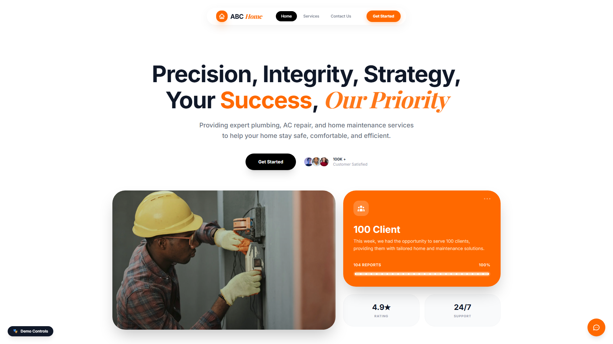
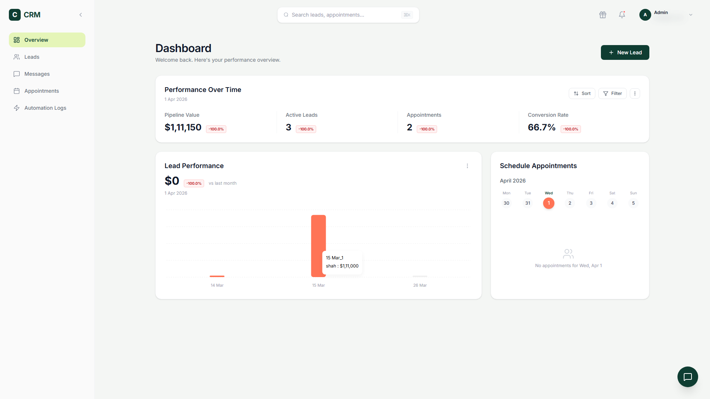
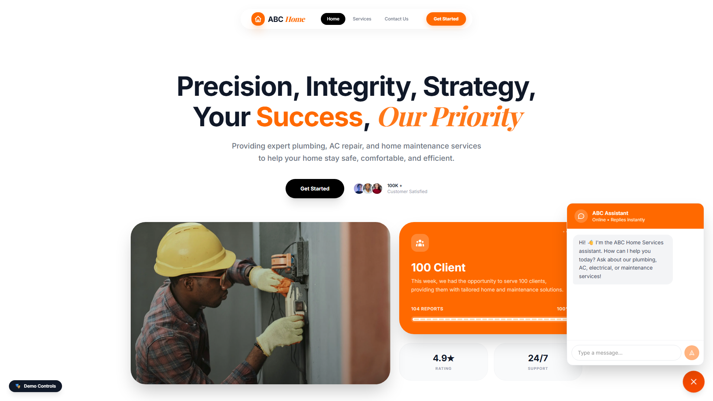
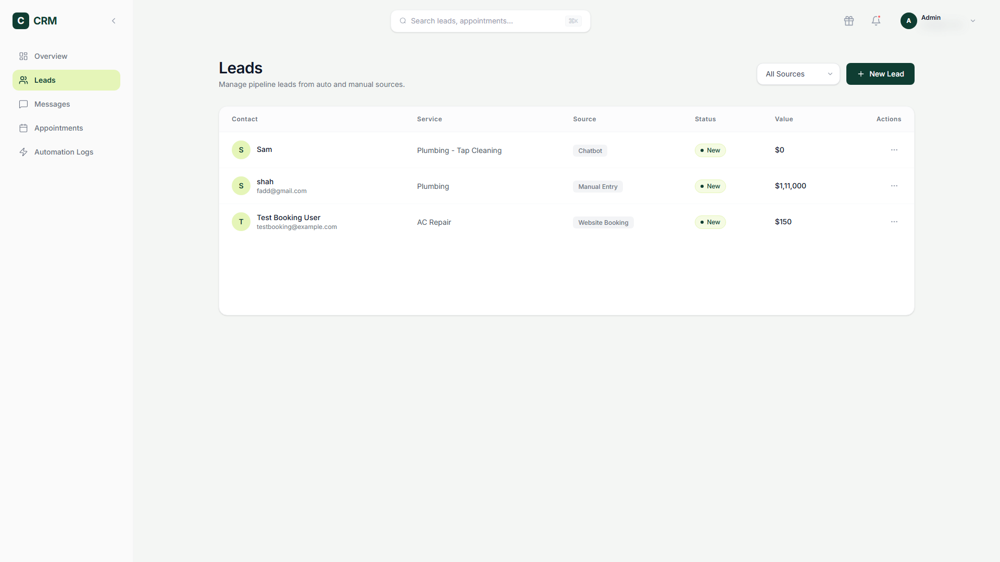
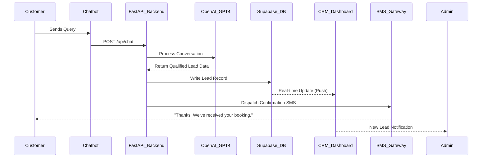

# Client-Capture-Automations: The Ultimate Service-Business Growth Engine

**Client-Capture-Automations** is a high-performance, full-stack ecosystem designed to eliminate lead drop-off and maximize revenue for service businesses. This platform demonstrates how a unified automation engine can bridge the gap between initial customer interest and final service completion.

---

## 🚀 The Three-Frontend Ecosystem

The platform consists of three seamlessly integrated applications, each serving a critical role in the customer lifecycle:

1.  **The Showcase Hub:** A high-conversion landing page that explains the ROI of automation to prospective clients.
    `https://showcase.your-agency.com`
    

2.  **The Demo Business Site (ABC Home Services):** A simulated, industry-neutral service business (Plumbing/HVAC) where users interact with live automations in real-time.
    `https://demo.your-agency.com`
    

3.  **The CRM Command Center:** A professional dashboard for business owners to track every lead, conversation, and automated event as it happens.
    `https://crm.your-agency.com`
    

---

## ⚙️ Six High-Impact Automations

This system features six end-to-end automations that solve the most common "leaks" in a service business's sales funnel:

### 1. 🤖 AI-Powered Chatbot (24/7 Lead Qualification)
*   **The Problem:** Leads go cold when they don't get an immediate response.
*   **The Solution:** An OpenAI-driven chatbot that answers FAQs, qualifies the lead's needs, and captures contact details directly into the CRM.

### 2. 📝 Automated Lead Capture & CRM Sync
*   **The Problem:** Manual data entry leads to lost opportunities.
*   **The Solution:** Every interaction—from contact forms to chatbot sessions—is instantly synced to a centralized PostgreSQL (Supabase) database.

### 3. 📞 Missed Call → SMS "Safety Net"
*   **The Problem:** 80% of callers won't leave a voicemail and will call a competitor instead.
*   **The Solution:** The system detects a missed call and immediately sends an automated SMS: *"Sorry we missed you! Would you like to schedule a callback?"*

### 4. ✉️ Instant Email Follow-Up
*   **The Problem:** Slow follow-up is the #1 reason for lost sales.
*   **The Solution:** The moment a lead is captured, a professional, personalized email is dispatched via Brevo/SendGrid to build trust and confirm receipt.

### 5. ⏰ Automated Appointment Reminders
*   **The Problem:** "No-shows" cost service businesses thousands in lost labor.
*   **The Solution:** Automated SMS reminders are triggered 24 hours before a scheduled service, drastically reducing cancellations.

### 6. ⭐ Reputation Management (Review Request)
*   **The Problem:** Happy customers forget to leave reviews.
*   **The Solution:** Once a job is marked "Completed" in the CRM, the system automatically sends a personalized SMS with a direct link to the business's review page.

---

## 🏗️ Technical Architecture

This project is built on a modern, decoupled stack designed for speed, security, and scalability:

*   **Frontend:** Next.js (React) + Tailwind CSS + Lucide Icons
*   **Backend:** Python (FastAPI) for high-concurrency API performance
*   **Database:** Supabase (PostgreSQL) with Real-time Subscriptions
*   **AI Engine:** OpenAI GPT-4o-mini (via OpenRouter)
*   **Communications:** Twilio (SMS) & Brevo/SendGrid (Email)
*   **Hosting:** Vercel (Frontend) & Render (Backend)

---

## 🔄 The Technical Flow (Sequence Diagram)

---

## 📽️ Live Demonstration (GIFs)

*For the full interactive experience, please see the following animated demonstrations:*

1.  **AI Instant Response:**
    ``
    *(The chatbot qualifies a lead and confirms details in < 2 seconds.)*

2.  **Real-time CRM Sync:**
    ``
    *(Watch a new lead appear in the dashboard instantly via Supabase subscriptions.)*

---

## 📊 Business Impact & Security
*   **[ROI Math & Financial Impact](ROI_MODEL.md):** How this system adds $10k+ in monthly revenue.
*   **[Security & Compliance Deep Dive](SECURITY.md):** How we protect client data and ensure PII privacy.
*   **[Detailed Use Cases](USE_CASES.md):** Deep dive into the 6 core automations.
*   **[Technical Architecture](ARCHITECTURE.md):** Full stack and data-flow overview.

---

## 🛡️ Privacy & Security
This repository is a **documentation-only showcase** of the platform's architecture and capabilities. The proprietary source code is maintained in a private environment to protect agency trade secrets and client configurations.

---

## 📩 Contact & Agency Inquiries
Interested in seeing a live demonstration of this system or discussing a custom automation solution for your business?

**[Your Agency Name / Link]**
*Empowering Service Businesses through Strategic Automation.*
